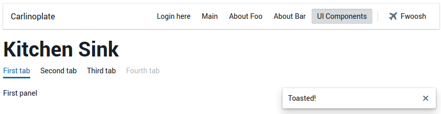

# Boilerplate

This is my boilerplate for one off frontend projects.
I try to update it every 6 months or so to keep up with the JS tooling steam roller.

## Mandatory Screenshot

## The Stack

 * [Webpack](https://webpack.github.io/) for modules and bundling.
 * [Typescript](https://www.typescriptlang.org/) and TSLint for sanity.
 * [BlueprintJS](http://blueprintjs.com/) for UI component
 * [React](https://facebook.github.io/react/) and [React Router](https://github.com/ReactTraining/react-router) for the view layer stuff.

## Usage

 1. `npm install`
 2. `npm start`
 3. Visit http://localhost:3002/

## TODOs

 - [ ] Route based code Splitting
 - [ ] Source maps
 - [ ] Side effect handlers/ middlewares
 - [ ] Testing and code coverage tools.
